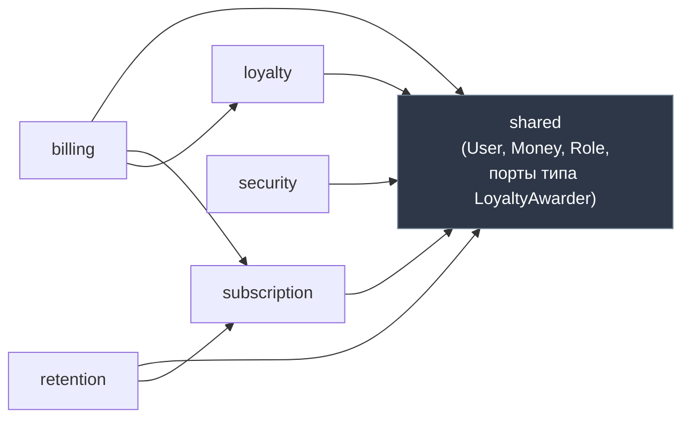
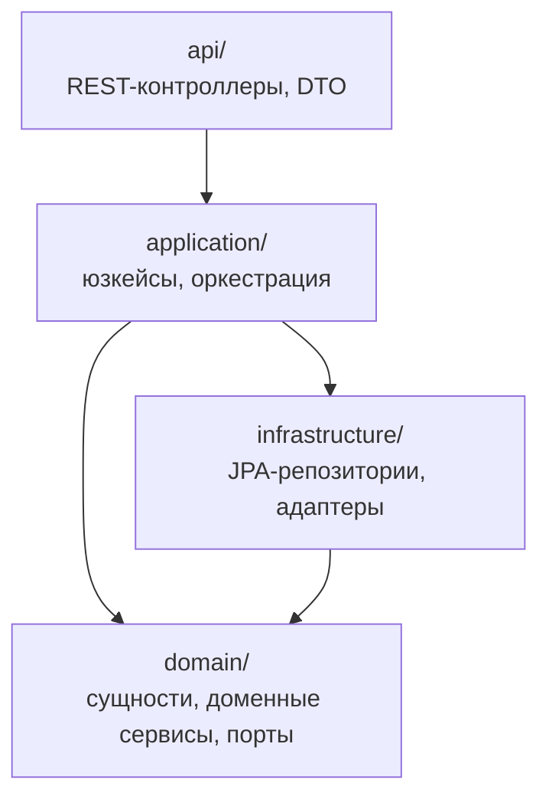
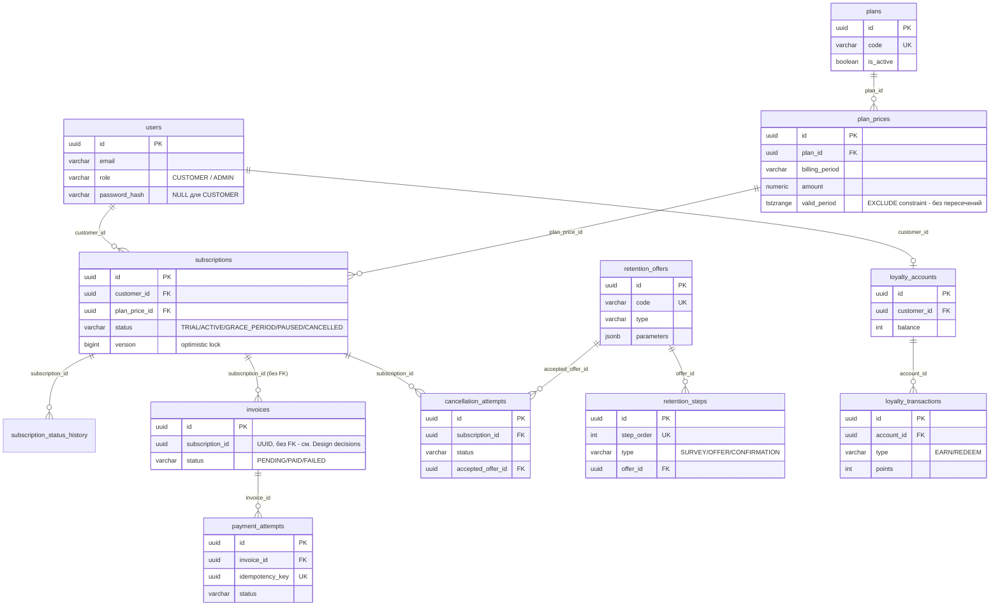

# Sublite Core


Backend платформы управления подписками: планы, жизненный цикл подписки, биллинг с идемпотентными списаниями, конфигурируемый флоу удержания при отмене (retention) и программа лояльности.

Домен вдохновлён двумя годами работы в подписке Яндекс Плюса — grace period, retention-офферы, начисление баллов это не выдуманные требования, а то, с чем реально приходилось работать. Есть также event-driven версия того же домена с биллингом, вынесенным в отдельный сервис (Kafka, Outbox, Saga, Kubernetes) — [Sublite Distributed](https://github.com/david-arutyunyan/sublite-distributed).

## Функциональность

| Модуль | Что делает |
|---|---|
| **subscription** | Планы (CRUD + версионирование цены), жизненный цикл подписки: `TRIAL → ACTIVE → GRACE_PERIOD → CANCELLED`, плюс `PAUSED` |
| **billing** | Генерация счетов по расписанию, идемпотентные списания, retry с экспоненциальной задержкой |
| **retention** | Конфигурируемый флоу отмены (опрос → оффер → подтверждение), офферы (скидка / пауза / баллы), кэш конфигурации в Redis |
| **loyalty** | Начисление и списание баллов по конфигурируемым правилам |
| **security** | JWT-аутентификация, роли `CUSTOMER`/`ADMIN`, admin-API |

## Стек

| Слой | Технологии |
|---|---|
| Язык / платформа | Java 21 (LTS), Spring Boot 4.1 |
| БД | PostgreSQL 17 + Flyway |
| Кэш | Redis |
| Безопасность | Spring Security, JWT (HS256, самостоятельный issuer) |
| Тесты | JUnit 5, Mockito, AssertJ, **Testcontainers** (реальный Postgres/Redis, не H2/моки), ArchUnit |
| API-документация | springdoc-openapi / Swagger UI |
| Наблюдаемость | Actuator, Micrometer + Prometheus, structured JSON-логи |
| Инфраструктура | Docker (multi-stage), Docker Compose, GitHub Actions |

## Быстрый старт

```bash
docker compose up -d
```

Одна команда поднимает Postgres, Redis и само приложение (собирается из `Dockerfile` при первом запуске), прогоняет все 23 Flyway-миграции и засеивает демо-админа. Приложение — на `http://localhost:8080`.

Проверить, что всё поднялось:
```bash
curl http://localhost:8080/health
curl http://localhost:8080/actuator/health/readiness
```

**Демо-админ** (сид, миграция `V23`): `admin@sublite.dev` / `admin123!` — это учётка для pet-проекта, не реальный секрет, поэтому спокойно лежит в миграции и здесь.

```bash
TOKEN=$(curl -s -X POST http://localhost:8080/auth/login \
  -H "Content-Type: application/json" \
  -d '{"email":"admin@sublite.dev","password":"admin123!"}' \
  | grep -o '"accessToken":"[^"]*"' | cut -d'"' -f4)

curl http://localhost:8080/admin/plans -H "Authorization: Bearer $TOKEN"
```

Для локальной разработки без Docker для самого приложения: `docker compose up -d postgres redis`, затем `./mvnw spring-boot:run` (нужен `JAVA_HOME`, указывающий на JDK 21).

## API

Swagger UI: `http://localhost:8080/swagger-ui/index.html` — все админ-эндпоинты задокументированы с примерами (`@Schema(example=...)`), кнопка **Authorize** принимает JWT из `/auth/login`.

Публичные эндпоинты: `GET /health`, `POST /auth/login`, `GET /actuator/health/**`. Всё под `/admin/**` и большая часть `/actuator/**` — только с ролью `ADMIN` (см. [Design decisions](#design-decisions)).

## Архитектура

Модульный монолит: каждый бизнес-модуль — это `domain` → `application` → `infrastructure` → `api`, между модулями зависимости идут только в одну сторону, и это не просто соглашение на словах — `ModuleBoundaryTest` (ArchUnit) ломает сборку, если кто-то тихо заведёт цикл.



Один нюанс, который в диаграмме не виден напрямую: `retention` начисляет баллы за принятый LOYALTY_POINTS-оффер, но **не импортирует** модуль `loyalty` — он зависит только от порта `LoyaltyAwarder`, объявленного в `shared`, а `loyalty.LoyaltyService` подставляется в него через Spring DI. `billing`, наоборот, зовёт `LoyaltyService` напрямую: `loyalty` уже существовал к моменту, когда его подключали к биллингу, так что разрывать через порт было нечего.

Внутри каждого модуля — hexagonal-слои:



## Схема БД

Отдельная Postgres-схема на модуль (`shared`, `subscription`, `billing`, `retention`, `loyalty`), миграции — Flyway, 23 файла в `src/main/resources/db/migration`.



`billing.invoices.subscription_id` — единственная связь без реального foreign key: `billing` это модуль-кандидат на вынос в отдельный сервис (см. Sublite Distributed), поэтому уже сейчас он трактует `subscription` как внешнюю границу, а не таблицу в той же БД.

## Тестирование

```bash
./mvnw test      # только unit-тесты (JUnit, без Testcontainers) - быстро
./mvnw verify     # unit + integration (*IT — Testcontainers: настоящий Postgres/Redis) + ArchUnit
```

28 unit-тестов + 40 интеграционных, все на реальных Postgres/Redis через Testcontainers, а не на H2 или моках. Отдельно стоит `SubscriptionConcurrentUpdateTest` — параллельный запрос одной и той же операции списания, проверяет, что при гонке проходит ровно одно списание (оптимистичная блокировка `@Version` + идемпотентный ключ).

## Наблюдаемость

- `GET /health` — минимальный liveness-чек без зависимостей (жив ли процесс вообще).
- `GET /actuator/health/liveness` / `.../readiness` — второй проверяет реальную связность с Postgres/Redis, первый — нет; ровно так, как и должны разделяться liveness/readiness для оркестратора.
- `GET /actuator/metrics`, `GET /actuator/prometheus` — только с ролью `ADMIN`.
- Структурированные JSON-логи (ECS-формат) включаются профилем `docker` (см. `SPRING_PROFILES_ACTIVE` в `docker-compose.yml`); при локальной разработке — обычный читаемый вывод в консоль. Каждая строка лога несёт `correlationId` (генерируется на входе в `CorrelationIdFilter`, эхом уходит в заголовке `X-Correlation-Id`).
- При запуске без Docker (`./mvnw spring-boot:run`) логи дополнительно пишутся в файл `logs/app.log` (с ротацией: до 10 МБ на файл, 7 файлов истории, 100 МБ суммарно) — внутри контейнера файла нет намеренно, там только stdout (`application-docker.yml` явно отключает файловый вывод).

### Централизованные логи (Loki)

Отдельный compose-оверлей (`docker-compose.observability.yml`), не часть основного `docker compose up` — Grafana/Loki/Promtail не нужны для обычной разработки:

```bash
docker compose -f docker-compose.yml -f docker-compose.observability.yml up -d
```

Promtail подключается к Docker-сокету (`docker_sd_configs`), сам находит все контейнеры проекта и раскладывает логи по лейблу `service` прямо из `com.docker.compose.service` — без единой строчки ручной конфигурации на контейнер. В Grafana (`http://localhost:3001` — не 3000, чтобы не конфликтовать с Grafana из Sublite Distributed, если оба проекта подняты одновременно; анонимный вход только для локального дева) логи каждого сервиса смотрятся отдельным запросом: `{service="app"}`, `{service="postgres"}`, `{service="redis"}`. Хранение — 30 дней (`limits_config.retention_period` в `observability/loki-config.yml`, реально удаляет старые чанки только вместе с `compactor.retention_enabled: true`).

По умолчанию postgres и redis почти ничего не пишут в лог — добавлены явные флаги: postgres логирует connect/disconnect и все изменяющие данные операторы (`log_statement=mod`) плюс медленные запросы (`log_min_duration_statement=200`), redis поднят на `--loglevel verbose` (события persistence/репликации, не построчный лог команд — для этого пришлось бы держать включённым `MONITOR`, а это отдельный debug-инструмент, не то, что стоит гонять постоянно).

## CI/CD

`.github/workflows/ci.yml`: на каждый push/PR в `master` — `./mvnw verify` (unit + integration на настоящих Postgres/Redis через Testcontainers, GitHub-раннеры идут с Docker из коробки) и сборка Docker-образа (без публикации куда-либо — registry для pet-проекта не нужен).

## Design decisions

Пять решений, которые стоило обосновать отдельно — и от чего отказались.

**1. Модульный монолит с границами, которые проверяет тест, а не только код-ревью.**
Отверг и микросервисы с самого начала (несоразмерная инфраструктурная цена для одного разработчика и одного bounded context, который ещё не устоялся), и "плоский" package-by-layer монолит (`controllers/`, `services/`, `repositories/` вперемешку по всему домену) — в нём ничего не мешает `retention`-сервису тихо задёрнуть JPA-репозиторий из `billing`, и это обнаружится только в проде. `ModuleBoundaryTest` (ArchUnit) ловит такие связи на CI, до мержа.

**2. Самостоятельный JWT (HS256) вместо внешнего IdP.**
Issuer и resource server — один и тот же процесс, так что симметричного ключа достаточно и не нужен второй сервис (Keycloak/Auth0) в `docker-compose.yml` ради внутренней admin-панели. В реальном проде это был бы RS256 с JWKS-эндпоинтом от отдельного identity-провайдера — замена ограничивается одним классом (`JwtConfig`), остальной код не знает, откуда берётся `JwtDecoder`.

**3. Идемпотентность списаний через уникальный constraint в БД, а не распределённую блокировку.**
Повторный запрос с тем же `idempotency_key` бьётся об уникальный индекс на `payment_attempts.idempotency_key` — проигравший в гонке ловит `DataIntegrityViolationException` и просто читает уже существующую запись. Это дешевле и надёжнее, чем городить Redis-based distributed lock ради операции, которая и так упирается в единственный источник истины — Postgres.

**4. Версионирование цены плана через `tstzrange` + `EXCLUDE`-constraint, а не мутацию строки.**
Подписка хранит ссылку на конкретную `plan_price`, а не на "текущую цену плана" — поэтому смена цены никогда не меняет то, что уже платит существующий подписчик. `EXCLUDE USING gist` физически не даёт вставить новую цену, пока не закрыт период действия старой — это ограничение целостности на уровне БД, а не проверка, которую можно случайно забыть в сервисном слое.

**5. ShedLock поверх Postgres для шедулера биллинга.**
При нескольких инстансах приложения `@Scheduled`-джоба выставления счетов без дополнительной защиты отработает на каждом инстансе параллельно — задвоит счета. ShedLock берёт advisory-подобную блокировку в отдельной таблице перед запуском джобы; не Redis (там уже есть кэш конфигурации retention, но лочить джобу через кэш — смешивать два разных назначения одного стораджа) и не Quartz (полноценный scheduler — overkill для одной периодической задачи).

## Структура репозитория

```
src/main/java/com/sublite/
├── subscription/   # планы, жизненный цикл подписки
├── billing/        # счета, списания, идемпотентность
├── retention/       # флоу отмены, офферы
├── loyalty/         # баллы
├── security/         # JWT, роли, admin-аутентификация
└── shared/           # value objects, порты, общая инфраструктура

src/main/resources/db/migration/   # 23 Flyway-миграции
.github/workflows/ci.yml            # CI
Dockerfile                          # multi-stage сборка
docker-compose.yml                  # postgres + redis + app
```

